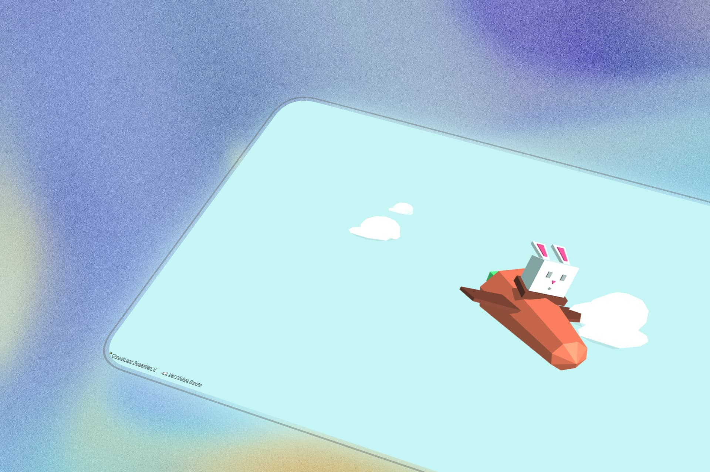

<div align="center">

# 🥕🐰 Bunny Flight

### A bunny pilot soaring through clouds, built from scratch with Three.js


<br>


<br>


<br>

[Live demo](https://bunny-flight-three-js.vercel.app/) · [Source code](https://github.com/sebastianvasquezechavarria1234/bunny-flight-three.js)

</div>

---

## About

Bunny Flight started as an exploration of what procedural geometry and code-driven animation can achieve. There are no external models, no downloaded textures — every shape exists because someone defined its vertices by hand.

The result is a short but hypnotic scene: a rabbit riding a carrot with wings, floating among clouds that drift across the screen. Simple in concept, careful in execution.

---

## What's in here?

| Component | What it does |
|-----------|--------------|
| **Carrot plane** | Deformed cylindrical body, vertex-adjusted wings, three spinning leaves |
| **Bunny pilot** | Bouncing ears, blinking eyes, integrated seat |
| **Clouds** | Three grouped spheres crossing the scene from right to left |
| **Scene** | Atmospheric fog, directional lighting, real-time shadows |

Each piece is a standalone class assembled in `main.js`. The architecture is deliberately simple: no build tools, no frameworks, no complications.

---

## Tech stack

| Technology | Purpose |
|------------|---------|
| **Three.js r110** | 3D engine and WebGL rendering. This version is used because the project modifies geometry vertices — something deprecated in later releases. |
| **GSAP 2.1.3** | All animations: floating, ear bouncing, blinking, cloud transit. |
| **HTML / CSS** | Minimal structure. CSS only removes margins and hides overflow. |

---

## Project structure

```
bunny-flight/
├── index.html        ← entry point
├── css/
│   └── style.css     ← global styles
├── js/
│   ├── utils.js      ← materials, constants, utilities
│   ├── Cloud.js      ← animated clouds
│   ├── Pilot.js      ← bunny pilot
│   ├── Carrot.js     ← carrot plane
│   └── main.js       ← scene orchestration
```

---

## Getting started

Nothing to install. Open `index.html` in a browser and you're set.

Or run a local server:

```bash
python -m http.server 8000
```

Then visit `http://localhost:8000`.

---

## Controls

| Action | Input |
|--------|-------|
| Rotate scene | Left click + drag |
| Zoom | Mouse wheel |
| Pan | Right click + drag |

---

## Technical details

The scene is built on an `internals` object that centralizes the renderer, camera, scene, and materials. Each class (`Carrot`, `Cloud`, `Pilot`) encapsulates its own geometry and animation, keeping the code modular without excessive abstraction.

Animations use `TweenMax` with `yoyo` and `Infinity` to create perpetual, natural motion. Clouds reset off-camera and reappear with randomized Y positions, giving a sense of continuity.

The light blue background (`#C5F5F5`) and fog create depth without a complex skybox.

---

## Palette

| | Color | Hex |
|---|-------|-----|
| Carrot | Orange | `#B7513C` |
| Leaves | Green | `#379351` |
| Wings / Seat | Brown | `#5C2C22` |
| Nose / Ears | Pink | `#B1325E` |
| Bunny | Gray | `#AAAAAA` |
| Clouds | White | `#EEEEEE` |
| Sky | Blue | `#C5F5F5` |

---
<div align="center">

Made with ❤️ by <a href="https://sebas-dev.vercel.app/" target="_blank" rel="noopener noreferrer">Sebastián V</a>

</div>
